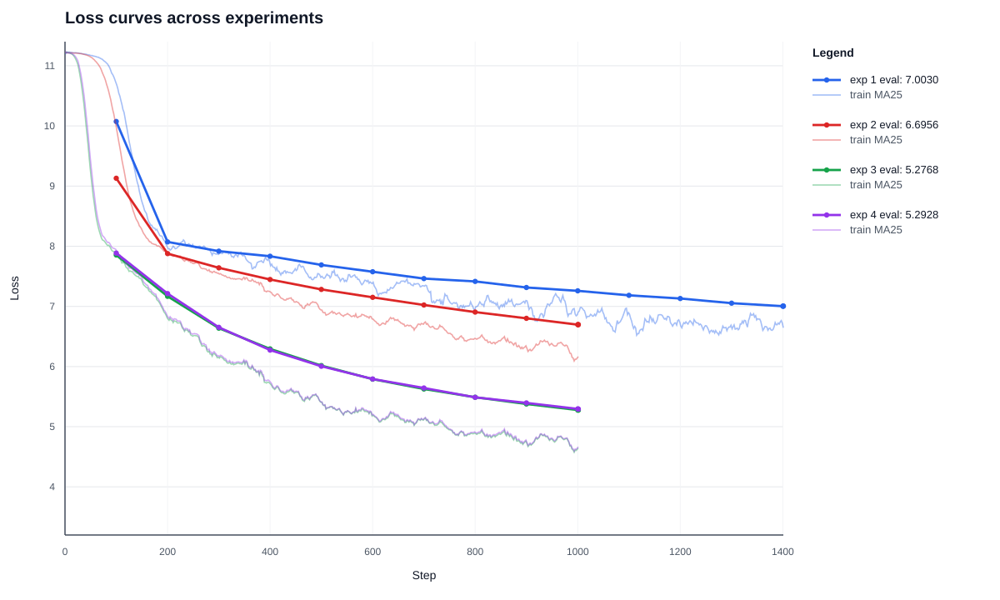

# HW 1 LLM Course (Pretrain)

## Задача

Pretrain Qwen3, посмотреть, как на малом масштабе ведут себя `train_loss`, `eval_loss`, perplexity и первичные генерации. Обучение ограничивалось 15 минутами на одной GPU A100 80GB.

## Данные и токенизация

Использовался датасет `wikimedia/wikipedia` конфигурация `20231101.ru` 

Разбиение фиксированное: первые `VALIDATION_SIZE = 5000` объектов уходят в validation/test, остальные используются для train:


Токенизатор `ai-forever/rugpt3small_based_on_gpt2` с макс. длиной = 512

## Модель

Использовался `Qwen3`

Для внимания использовался `flash_attention_2`, модель создавалась в `torch.bfloat16`.

## Обучение

Общие параметры, которые оставались одинаковыми:

| Параметр | Значение |
|---|---:|
| `optim` | `adamw_torch_fused` |
| `weight_decay` | `0.01` |
| `warmup_steps` | `200` |
| `eval_steps` | `100` |
| `logging_steps` | `1` |
| `bf16` | `True` |
| `tf32` | `True` |
| `gradient_checkpointing` | `False` |
| `torch_compile` | `False` |

## Эксперименты

| Эксперимент | Batch size | LR | Scheduler | Final `eval_loss` | Perplexity |
|---|---:|---:|---|---:|---:|
| 1 baseline | 4 | `5e-5` | linear/default | `7.0030` | `1099.93` |
| 2 larger batch | 16 | `5e-5` | linear/default | `6.6956` | `808.84` |
| 3 higher LR | 16 | `3e-4` | linear/default | **`5.2768`** | **`195.74`** |
| 4 cosine scheduler | 16 | `3e-4` | cosine | `5.2928` | `198.91` |

Лучший результат получился в эксперименте 3: увеличение batch size с 4 до 16 и learning rate с `5e-5` до `3e-4` заметно ускорило обучение за тот же лимит времени. Cosine scheduler дал очень близкий результат, но немного хуже по финальному `eval_loss`.

## Loss

Сводный график ниже показывает `eval_loss` и сглаженный `train_loss` по всем запускам.



Интерактивные Plotly-графики:

- [experiment 1 loss](1%20exp/loss_curve.html)
- [experiment 2 loss](2%20exp/loss_curve.html)
- [experiment 3 loss](3%20exp/loss_curve.html)
- [experiment 4 loss](4%20exp/loss_curve.html)

Наблюдения по loss:

- В начале все модели стартуют около loss `11`, что ожидаемо для модели со случайной инициализацией.
- Эксперимент 1 делает больше optimizer steps из-за меньшего batch size, но качество хуже: шаги более шумные, а эффективная обработка токенов за время ниже.
- Переход от batch size `4` к `16` улучшил финальный `eval_loss` с `7.0030` до `6.6956`.
- Увеличение LR до `3e-4` дало главный выигрыш: `eval_loss` снизился до `5.2768`.
- Между linear/default и cosine scheduler при `lr=3e-4` разница маленькая: `5.2768` против `5.2928`.

## Примеры генераций

Для генерации использовались `do_sample=True`, `top_p=0.9`, `temperature=1`, `max_new_tokens=64`.

### Эксперимент 1

```text
Prompt: Столица Франции -
Generation: Столица Франции -  —,-У.
 : 


 Официаль,8 — 4. Д. — М.: В. — американский. — 7-7-2-8 человек. В. А. В. — М.:
 А. — № А
```

Генерация почти не держит структуру текста: много одиночных символов, пунктуации и обрывков.

### Эксперимент 2

```text
Prompt: Столица Франции -
Generation: Столица Франции -  —  — город в  — деревня в созвез, протекаетском районе Тверской области России.

География
Родился в центральной части — в пределах юго-востоку от районного центра поселения.
```

Появляются типичные шаблоны Wikipedia: "город", "деревня", "География", "Население". Факты еще бессмысленные, но локальная форма русского энциклопедического текста уже заметна.

### Эксперимент 3

```text
Prompt: Столица Франции -
Generation: Столица Франции -  —  название населённых пунктов в России:

Украина
 Сидорова-Курская улица — улица.
 Каховская улица — улица в городе.
 Курильская улица — улица в Новосибирске.
```

Лучший запуск чаще воспроизводит формат статей: списки, заголовки, категории, географические и биографические шаблоны. Семантически текст все еще галлюцинирует, но стал более языкоподобным.

### Эксперимент 4

```text
Prompt: Столица Франции -
Generation: Столица Франции -  — административно-территориальная единица в России, в городе Куропоминского района, Пермской области.

Площадь населения по данным переписи 2001 года, в деревне проживало 225 человек.

География
```

Cosine scheduler дал похожее качество генераций: модель уверенно копирует энциклопедический стиль, но еще не выучила устойчивые факты и длинную согласованность.

## Итоги

За 15 минут модель действительно начинает учить локальную структуру русского текста: loss падает, perplexity снижается, а генерации переходят от почти случайных токенов к фрагментам, похожим на статьи Wikipedia.

Лучший запуск:

```text
per_device_train_batch_size = 16
gradient_accumulation_steps = 1
learning_rate = 3e-4
lr_scheduler_type = default/linear
optim = adamw_torch_fused
bf16 = True
tf32 = True
torch_compile = False
```

Финальный результат лучшего запуска:

```text
eval_loss = 5.2768
perplexity = 195.74
```

Главный вывод: при коротком бюджете обучения learning rate и эффективный batch size оказались самыми важными параметрами. Более агрессивный LR `3e-4` успевает сильно продвинуть модель за 15 минут, а cosine scheduler в этом сетапе не дал преимущества над default scheduler.
